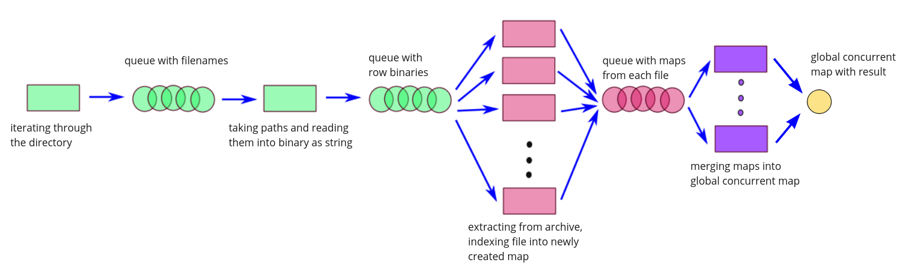
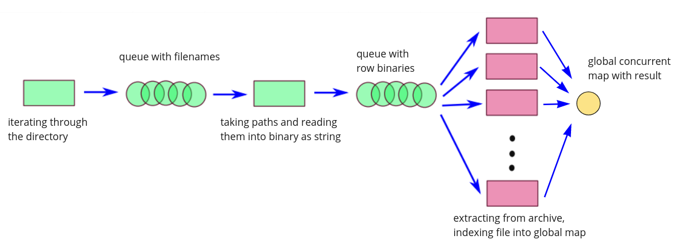

# N-gram_words-prediction

#### To Run 

```
$ ./bin/ngram path n n_words_to_predict context*
```
*context is optional

### Results
#### With indexing and merging threads
Was used tbb concurrent_bounded_queue and tbb concurrent_hash_map.
###### Pipeline

Run with 4 indexing and 4 merging threads
```bash
❯ ./bin/ngram /hutenberg_lib/3/3/3 3 6 to me
Total counting time: 6256 ms
Finding files time: 16 ms
Reading files time: 65 ms
to me and i have been a great 
```
Memory usage: ~**1.1 GB**
```bash
❯ ./bin/ngram /hutenberg_lib/3/3 3 6 to me    
Total counting time: 68713 ms
Finding files time: 161 ms
Reading files time: 1089 ms
to me and i have been a great 
```
Memory usage: ~**7.4 GB**

I tried to run on `/hutenberg_lib/3`, and it took all my RAM (8GB from start point) + 14 GB of swap, and then some lock happened (all core activity was below 20%, but memory was very slowly increasing).
I tried with different queue size(it should be connected to queues running out of space)

#### With only indexing threads
"Only indexing threads" means that indexing threads are merging their result directly into global map, and merging threads are not used.

Was used tbb concurrent_bounded_queue and tbb concurrent_hash_map.
###### Pipeline

Run with 4 indexing threads
```bash
 ❯ ./bin/ngram /hutenberg_lib/3/3/3 3 6 to me
Total counting time: 3256 ms
Finding files time: 9 ms
Reading files time: 55 ms
to me and i have been a great 
```
Memory usage: ~**1 GB**

```bash
❯ ./bin/ngram /hutenberg_lib/3/3 3 6 to me
Total counting time: 37422 ms
Finding files time: 98 ms
Reading files time: 586 ms
to me and i have been a great 
```
Memory usage: ~**7 GB**


I tried to run on `/hutenberg_lib/3`, and it took all my RAM (11GB from start point) + 6 GB of swap, and them the same as before happened.
I tried with different queue size, and nothing changed. It was locking on the same point.

Maybe it's because of memory overload.